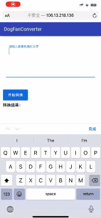

## DogFanConverter 狗粉丝抽象话转换器

### 项目介绍
一个将普通话转为抽象话的小工具，后台使用Java SpringBoot实现，前台使用HTML实现

### 实现原理
获取到输入的每个字的无声调拼音，通过预置的csv表情拼音字典进行表情替换，继而输出抽象话。

### 预览地址
http://106.13.218.136/

### Gif预览

### 使用方法
clone源码并使用maven编译，`nohup java -jar xx.jar &`运行，然后在`app.html`中修改ip和端口便可使用

或者直接打开`app.html`通过在线调用